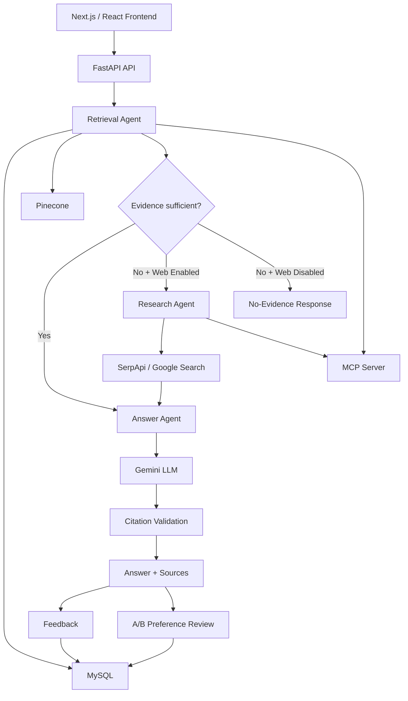

# People Atlas

**People Atlas** is a database-first, agentic Retrieval-Augmented Generation (RAG) application for evidence-backed people and knowledge research.

The system searches its own knowledge base first using **MySQL + Pinecone semantic retrieval**. If the available evidence is insufficient and the user allows web research, People Atlas falls back to **Google search through SerpApi**. **Gemini** generates answers only from the selected evidence, with visible citations and explicit handling when reliable evidence is unavailable.

## Live UI

**Hosted UI preview:**
https://people-atlas-rag.prassu.chatgpt.site/

The complete live RAG backend can also be run locally using Docker.

---

## Why People Atlas?

A typical chatbot can answer a question without clearly showing where the answer came from.

People Atlas is designed around a different workflow:

1. Search trusted application data first.
2. Retrieve semantically relevant evidence.
3. Determine whether that evidence is sufficient.
4. Use web research only when necessary and explicitly allowed.
5. Generate an answer from the retrieved evidence.
6. Validate citations.
7. Preserve the sources shown to the user.
8. Collect human feedback and answer preferences for future improvement.

This makes the system more traceable and reduces unsupported generation.

---

# Architecture



---

# Core RAG Behavior

People Atlas follows a **database-first, web-when-needed** strategy.

### Database evidence is sufficient

```text
User Query
    ↓
MySQL + Pinecone
    ↓
Relevant evidence found
    ↓
Gemini
    ↓
Cited answer
```

The web-search service is not called.

### Database evidence is insufficient and web search is enabled

```text
User Query
    ↓
MySQL + Pinecone
    ↓
Insufficient evidence
    ↓
Research Agent
    ↓
SerpApi / Google Search
    ↓
Gemini
    ↓
Cited answer
```

### Database evidence is insufficient and web search is disabled

```text
User Query
    ↓
MySQL + Pinecone
    ↓
Insufficient evidence
    ↓
No external search
    ↓
Graceful no-evidence response
```

The application does not intentionally generate an unsupported answer when reliable evidence is unavailable.

---

# Technology Stack

| Layer                | Technology                                    |
| -------------------- | --------------------------------------------- |
| Frontend             | Next.js, React, TypeScript                    |
| Styling/UI           | Tailwind CSS, shadcn/ui                       |
| Backend              | Python, FastAPI                               |
| Relational database  | MySQL                                         |
| Vector database      | Pinecone                                      |
| LLM                  | Gemini 3.6 Flash                              |
| Embeddings           | Gemini Embedding 2                            |
| Embedding dimensions | 3072                                          |
| Web research         | SerpApi                                       |
| Agent tools          | Model Context Protocol (MCP)                  |
| Containers           | Docker, Docker Compose                        |
| Evaluation           | Python unit tests + offline + live evaluation |
| Feedback             | MySQL                                         |
| Preference data      | A/B answer comparison                         |
| CI                   | GitHub Actions                                |
| Source control       | GitHub                                        |

---

# Agent Architecture

The backend separates major responsibilities into services.

### Retrieval Agent

Searches application knowledge using:

* MySQL
* Gemini embeddings
* Pinecone vector similarity
* retrieval sufficiency logic

### Research Agent

Runs only when database evidence is insufficient and web fallback is allowed.

It uses SerpApi to retrieve external search evidence.

### Answer Agent

Receives a maximum bounded evidence set and asks Gemini to generate a grounded answer with source IDs.

The current pipeline limits the final context to **12 sources maximum**.

### MCP Server

The MCP service exposes tools used by the agent layer, including retrieval and external-search capabilities.

This keeps external systems decoupled from individual agents.

---

# Data

The current RAG demonstration uses public **HotpotQA / Wikipedia-derived historical excerpts** as its primary indexed corpus.

The current development index contains approximately **200 indexed records**.

HotpotQA reference answers are kept separate from retrieval data where evaluation requires avoiding answer leakage.

Historical excerpts should not be treated as verification of current facts. Current-information queries can use the web-research fallback when enabled.

---

# Repository Structure

```text
people-atlas-rag/
│
├── app/
│   ├── api/atlas/
│   ├── page.tsx
│   └── ...
│
├── backend/
│   ├── api.py
│   ├── agents.py
│   ├── core.py
│   ├── db.py
│   ├── ingest.py
│   ├── mcp_server.py
│   ├── providers.py
│   ├── evaluate.py
│   ├── live_evaluate.py
│   ├── verify_integrations.py
│   ├── schema.sql
│   ├── data/
│   └── tests/
│
├── components/
├── db/
├── docs/
├── infra/
├── scripts/
├── training/
│
├── docker-compose.yml
├── .env.example
├── .gitignore
└── README.md
```

---

# Environment Configuration

Copy the example environment file:

```bash
cp .env.example .env
```

Configure your own credentials in `.env`.

Required external services for full live mode:

* Gemini API
* Pinecone
* SerpApi

The application also uses internally generated values for:

* MySQL password
* MySQL root password
* RAG API token
* internal service token

For local frontend access:

```env
RAG_API_URL=http://127.0.0.1:8000
```

Important configuration:

```env
LLM_MODEL=gemini-3.6-flash

EMBEDDING_MODEL=gemini-embedding-2
EMBEDDING_DIMENSIONS=3072

PINECONE_NAMESPACE=hotpotqa-v1
RETRIEVAL_THRESHOLD=0.78
```

**Never commit `.env` or real API credentials.**

Only `.env.example` belongs in source control.

---

# Local Setup

## Requirements

* Docker Desktop
* Node.js
* pnpm
* Git

## 1. Clone the repository

```bash
git clone https://github.com/sindhura-paruchuri/people-atlas-rag.git
cd people-atlas-rag
```

## 2. Configure environment variables

```bash
cp .env.example .env
```

Add your own service credentials to `.env`.

## 3. Start backend services

```bash
docker compose up --build -d
```

Docker starts the major services, including:

* MySQL
* MCP server
* Retrieval Agent
* Research Agent
* Answer Agent
* FastAPI API

## 4. Load/index data

```bash
docker compose --profile tools run --rm ingest
```

## 5. Install frontend dependencies

```bash
corepack enable
pnpm install --frozen-lockfile
```

## 6. Start the frontend

```bash
pnpm dev
```

Local frontend:

```text
http://localhost:5173
```

---

# Integration Verification

The repository contains:

```text
backend/verify_integrations.py
```

The integration workflow has been used to validate:

* MySQL reads/writes
* Gemini embeddings
* Pinecone queries
* MCP tool execution
* SerpApi web fallback
* Gemini answer generation

---

# Testing

Run backend unit tests with:

```bash
docker compose exec api python -m unittest discover -s tests -v
```

Current result:

```text
21 tests passed
0 failures
```

The suite covers areas including:

* authentication
* invalid input handling
* database-first routing
* web fallback
* web-disabled routing
* backend failure behavior
* feedback persistence behavior
* preference persistence
* citation rejection
* dataset integrity
* source URL handling
* embedding dimension alignment

---

# Offline Retrieval Evaluation

Run:

```bash
docker compose exec api python evaluate.py
```

This evaluation measures the bundled lexical/seed retrieval layer. It does **not** represent full live Pinecone or LLM performance.

Current sample results:

| Query         |                   Precision@3 |                      Recall@3 |
| ------------- | ----------------------------: | ----------------------------: |
| Python Austin |                         66.7% |                          100% |
| MySQL         |                          100% |                          100% |
| RAG           |                          100% |                          100% |
| Unknown query | Correctly returned no records | Correctly returned no records |

---

# Live End-to-End Evaluation

People Atlas also includes:

```text
backend/live_evaluate.py
```

This evaluates the real running RAG application rather than only local retrieval logic.

The live smoke test covers:

1. database/Pinecone retrieval
2. web fallback
3. web-disabled behavior
4. citation validation
5. routing
6. latency
7. token usage

Run:

```bash
docker compose exec -w /tmp api python /app/live_evaluate.py
```

Latest validated smoke-test result:

```text
Successful requests: 3/3
Routing accuracy: 100%
Citation-valid rate: 100%
Average latency: 3836 ms
```

Individual observed latencies in the validation run were approximately:

```text
Database retrieval: 4855 ms
Web fallback:       5548 ms
Web disabled:       1104 ms
```

**Important:** the 100% routing and citation values refer only to this three-case live smoke-test suite. They are not a claim of 100% accuracy across arbitrary questions.

---

# Human Feedback

Every source-backed answer can receive:

```text
👍 Helpful
👎 Not helpful
```

Feedback is stored in MySQL and linked to the original query.

This gives the project a persistent feedback loop that can be analyzed during future retrieval and prompt optimization.

---

# Preference / RLHF-Ready Workflow

People Atlas includes pairwise answer comparison.

For eligible source-backed answers, the user can:

1. generate an alternative answer
2. compare Answer A and Answer B
3. select:

   * A
   * B
   * Tie
   * Neither
4. save the preference

The resulting records form preference data suitable for future experimentation with:

* reward modeling
* Direct Preference Optimization (DPO)
* supervised preference tuning
* retrieval/prompt optimization

The repository also includes experimental training utilities under:

```text
training/
```

**People Atlas does not claim that Gemini itself was trained with RLHF.**

The implemented feature is an **RLHF-ready human-preference collection and experimental training workflow**.

---

# Security

People Atlas keeps provider credentials out of the browser.

The frontend calls a same-origin API proxy:

```text
app/api/atlas/route.ts
```

The server-side proxy communicates with FastAPI using the configured application token.

Additional protections include:

* `.env` excluded from Git
* separate internal service token
* authenticated FastAPI endpoints
* bounded query length
* bounded evidence count
* citation validation
* explicit failure responses
* source URL validation
* provider secrets stored server-side only

---

# Cost-Aware Design

The development version is designed to work within available free-tier service limits.

Cost/usage is reduced by:

* querying the internal knowledge base before external search
* calling SerpApi only when retrieval is insufficient
* limiting retrieved evidence
* limiting final answer context to a maximum of 12 sources
* avoiding unnecessary web requests
* allowing web search to be disabled completely

Free-tier quotas and provider policies can change, so users should verify current provider limits before deploying their own instance.

---

# Current Status

Implemented and validated:

* ✅ Next.js/React frontend
* ✅ FastAPI backend
* ✅ MySQL persistence
* ✅ Pinecone vector retrieval
* ✅ Gemini generation
* ✅ Gemini embeddings
* ✅ MCP server/tools
* ✅ Retrieval Agent
* ✅ Research Agent
* ✅ Answer Agent
* ✅ Database-first routing
* ✅ Conditional SerpApi fallback
* ✅ Web-disabled safe behavior
* ✅ Source citations
* ✅ Feedback persistence
* ✅ A/B preference collection
* ✅ Docker Compose
* ✅ Unit tests
* ✅ Offline evaluation
* ✅ Live end-to-end smoke evaluation
* ✅ GitHub Actions workflow
* ✅ GitHub repository

Remaining deployment work:

* production-host the Python/Docker backend
* point the hosted People Atlas frontend at that public HTTPS API
* run a larger evaluation suite for broader quality measurements

---

# Design Principle

> **Database first. Web when needed. Sources stay visible. Uncertainty stays explicit.**

People Atlas is intended to demonstrate that a RAG application can do more than retrieve documents and call an LLM: it can make explicit routing decisions, use tools through MCP, preserve evidence, reject unsupported generation, collect human preferences, and expose measurable behavior.

---

# License and Data Attribution

The application code and third-party dependencies are subject to their respective licenses.

The demonstration corpus includes public HotpotQA/Wikipedia-derived material. Review the dataset documentation and attribution requirements before redistributing or replacing the corpus.

For private or organizational deployments, only ingest information you are authorized to store, embed, process, and redistribute.
