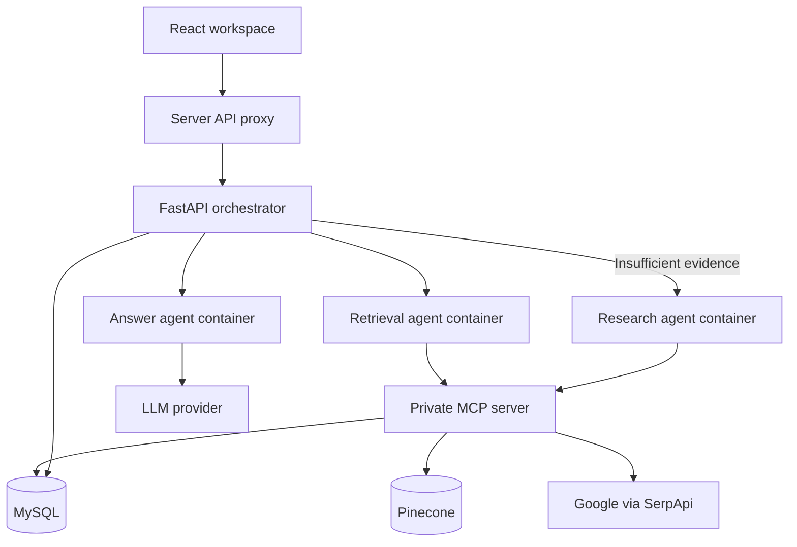

# Architecture and network calls

## A question, step by step

1. The browser submits the question and web-search preference to `/api/atlas`.
2. The frontend server validates the request and calls the Python `/query` API over HTTPS in hosted mode. It attaches the service bearer token without exposing it to the browser.
3. The orchestrator calls the retrieval container over the private Docker network.
4. The retrieval agent initializes an MCP client session and calls `retrieve_people`.
5. MCP queries MySQL with parameterized text filters, embeds the question, searches Pinecone, and hydrates vector IDs from canonical SQL records. The vector metadata is not treated as the source of truth.
6. The retrieval agent applies a conservative score-plus-keyword sufficiency heuristic. It is an initial routing policy, not a confidence probability or guarantee of semantic coverage.
7. If evidence is insufficient and web search is enabled, the orchestrator calls the research agent, which invokes the MCP `search_public_web` tool. That tool gets Google result snippets through SerpApi and applies any configured domain allowlist.
8. The orchestrator numbers sources and sends bounded evidence to the answer agent. The agent calls the configured LLM. Its system instructions require grounding and treat retrieved content as untrusted.
9. The answer agent checks citation IDs. This catches missing/out-of-range citations; it does not prove entailment or truth. On check failure, it withholds the generated text and returns an explicit message.
10. The orchestrator stores the question, answer, evidence, trace, latency, and usage in MySQL. It returns them to the UI. Feedback references the persisted query ID and uses a foreign key.

| Network hop | Protocol | Authentication |
|---|---|---|
| Browser → frontend | HTTPS / JSON | Private Sites access in hosted demo |
| Frontend → API | HTTPS / JSON; localhost HTTP for development | RAG_API_TOKEN |
| API → agents | Private HTTP / JSON | INTERNAL_TOKEN |
| Agents → MCP | MCP over Streamable HTTP | Private Docker network boundary; host validation |
| MCP/API/ingest → MySQL | MySQL TCP, port 3306 | Database user/password |
| MCP/ingest → Pinecone | HTTPS / JSON | Pinecone Api-Key |
| Answer → model | HTTPS / JSON | Provider bearer key |
| MCP → Google results provider | HTTPS / JSON | SerpApi key |

## Agent roles

This is a bounded multi-agent workflow: retrieval and research roles execute retrieval tools, while the answer role uses an LLM over combined evidence. Not every agent needs its own LLM call or a complete independent RAG stack; duplicating generation in each role would add cost without a clear need here. An agent is program logic with a role and tools; a container packages and runs that logic. MCP is the tool protocol, not the model or container runtime.

The frontend's optional WebMCP registration is a separate browser API for asking the visible workspace a question. It is not the private Python MCP server. It is feature-detected and does not prevent ordinary use in unsupported browsers.

## Failure boundaries

External calls have timeouts and bounded retries for selected transient statuses. The entire orchestration has an 80-second bound. The web provider can fail while allowing a database-only answer, and this is visible in the trace. Retrieval or persistence failures return an error instead of presenting an apparently successful unrecorded answer. A timeout can still incur provider billing for a request already accepted remotely.

Source hyperlinks must use HTTPS. The app displays text through React escaping; it does not render arbitrary source HTML or fetch user-provided URLs. Google snippets are labeled as snippets, not full-page verification. The system does not merge identity records from unrelated web results.
